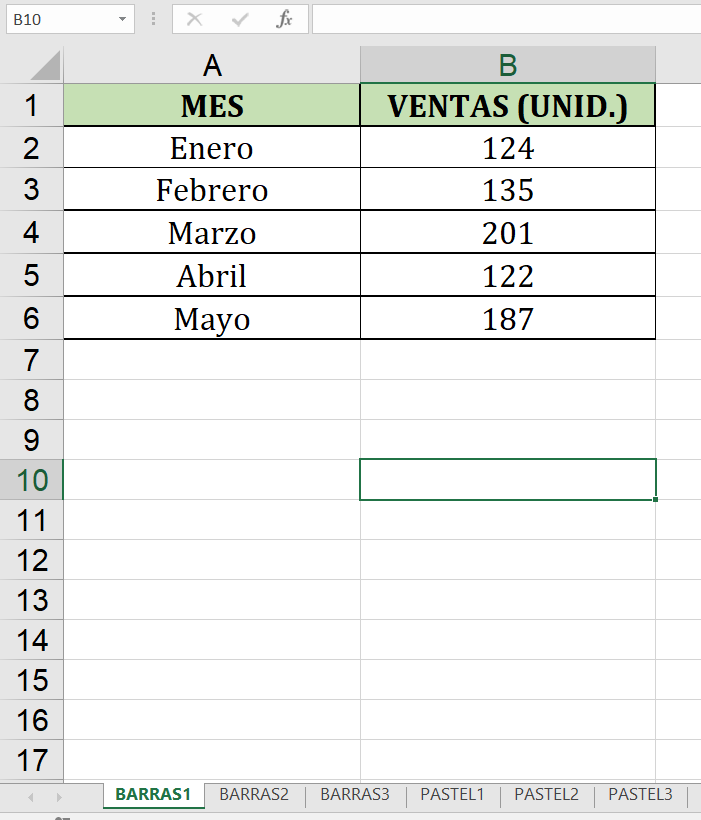
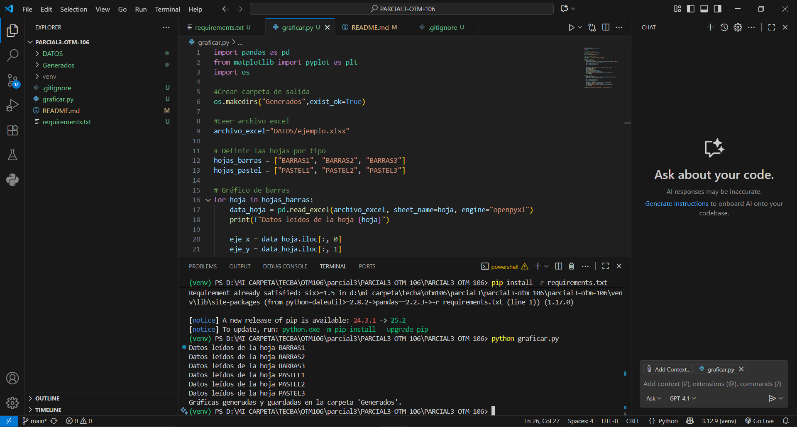
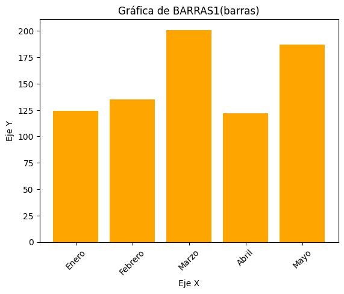
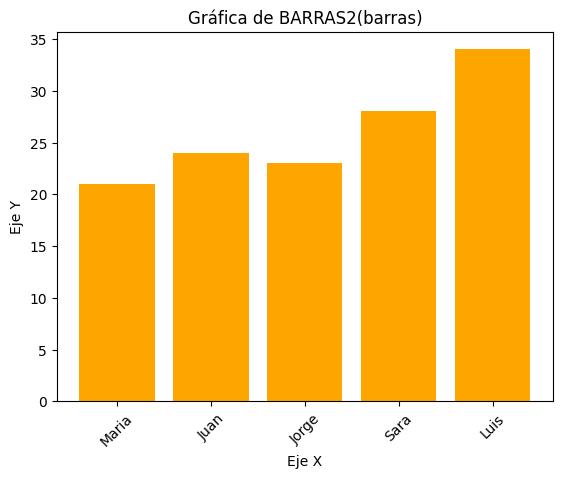
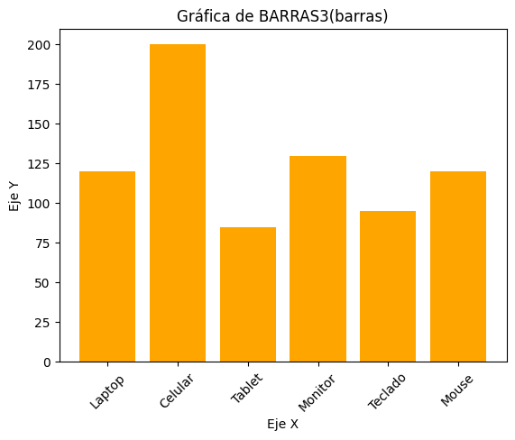
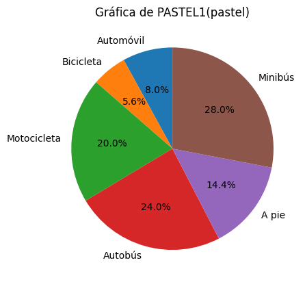
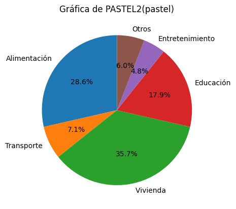
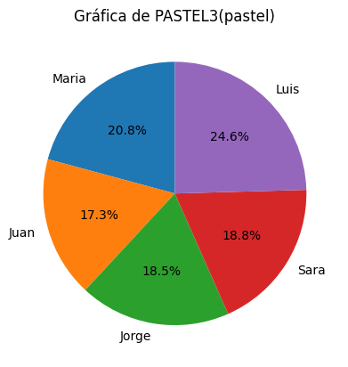

# PARCIAL3-OTM-106

## Estudiante: Walter Antonio Machaca Anze

## Materia: Ofimática y tecnología multimedia OTM-106

## CREACIÓN DE TABLAS EN EXCEL

Captura de tablas de excel

## GENERACIÓN DE GRÁFICAS CON PYTHON 

Captura de ejecución del script

## GRÁFICAS GENERADAS

Gráfico1 Barras

Gráfico2 Barras 

Gráfico3 Barras

Gráfico1 Pastel 

Gráfico2 Pastel

Gráfico3 Pastel 

